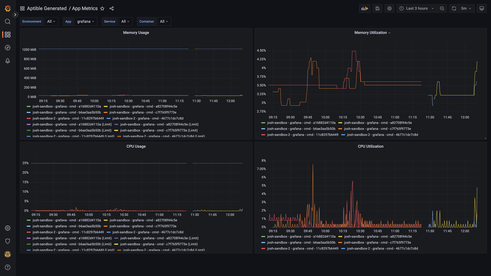
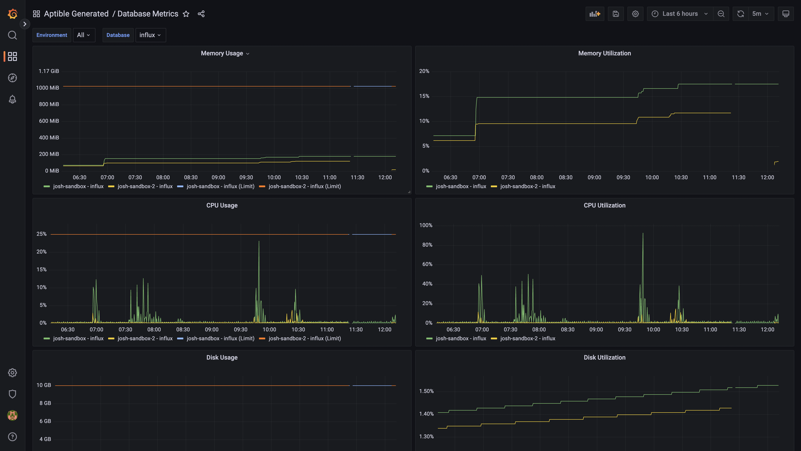
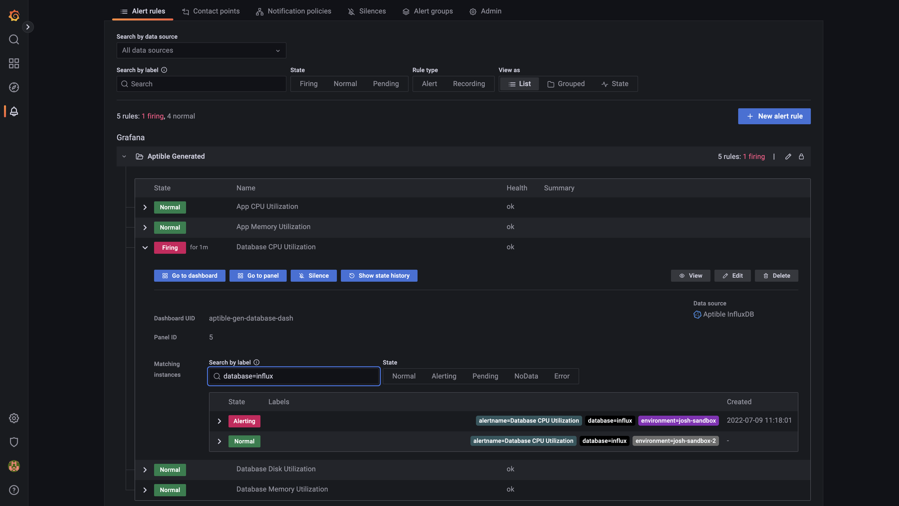

# Aptible Metric Drain Generator

## Goal

Automate provisioning and configuring the necessary resources to collect metrics
for containers running on Aptible.

## Requirements

The [Aptible CLI](https://deploy-docs.aptible.com/docs/cli) is required to
create the Metric Drain and its resources and you must be logged in with
`aptible login`. Dashboards can be generated without it if credentials and
connection details are provided via environment variables.

## Usage

### Create the drain

```shell
./create-drain-stack.sh enviroment_handle
```

Provisions and configures an InfluxDB Database, PostgreSQL Database, Grafana
App, and InfluxDB Metric Drain in the specified Environment if they do not
exist. If the Grafana App doesn't exist `./generate-dashboards` is run on it.

`METRICS_ENVIRONEMNT` can be used to specify a different environment for the
InfluxDB Database, PostgreSQL Database, and Grafana App. This can be used to
configure multiple environments to send metrics to the same destination. For
example:

Note: This repo was tested against Grafana version `9.0.2`. The version can be
changed by setting `GRAFANA_TAG`. The default is `latest`.

### Create Grafana dashboards

```shell
./generate-dashboards.sh [environment_handle] [grafana_handle=grafana]
```

Creates a set of useful dashboards for the metrics provided by Metric Drains (or
updates them if they already exist). All of the dashboards defined in
`grafana/dashboards` will be applied. Also creates alert rules for resource
utilization if they don't exist.

The credentials and connection details for Grafana are extracted from the
specified Aptible App's configuration or they can be supplied through the
`GRAFANA_USER`, `GRAFANA_PASSWORD`, and `GRAFANA_URL` environment variables.

### Re-create Grafana alerts

```shell
./recreate-alerts.sh [environment_handle] [grafana_handle=grafana]
```

Unfortunately it's not quite as easy to update alert rules as it is dashboards
so this script deletes the existing ones and re-creates them. The only downside
of this is that the alert rule state history is cleared. The Dashboard will
show the past alerts and alert notifications that have been sent out will still
exist.

This script handles credentials and connection details the same way as
`generate-dashboards.sh`. See above for details.

### Set up alert notifications

This repo does not configure alert notifications but they can be configured
relatively easily through the Grafana UI. All you need to do is:

1. Create a contact point such as an email list or Slack integration at Alerting
\> Contact points (`https://$GRAFANA_URL/alerting/notifications`).
2. Add the contact point to a notification policy at Alerting > Notification
policies (`https://$GRAFANA_URL/alerting/routes`).
 
The generated alert rules are labeled with `alertgroup=aptible-generated` so
this can be used to create a specific policy for these alerts.

## Examples

### Create all resources in a single Environment

```shell
/create-drain-stack.sh aptible-production
```

### Drain multiple Environments to the same metrics Environment

```shell
export METRICS_ENVIRONMENT=aptible-metrics

./create-drain-stack.sh aptible-production
./create-drain-stack.sh aptible-staging
./create-drain-stack.sh aptible-dev
```

### Update dashboards

```shell
/generate-dashboards.sh aptible-production
```

## Dashboard Screenshots

### App Metrics



## Database Metrics



## Alerts


