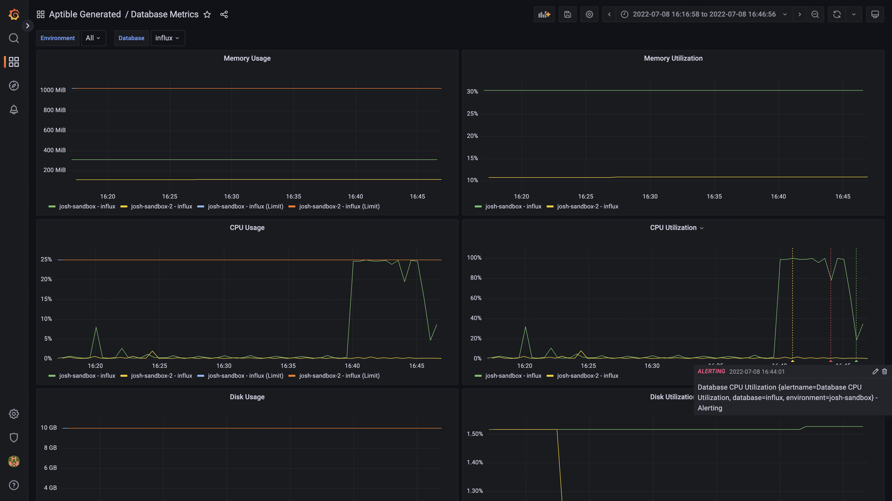

# Aptible Metric Drain Generator

## Goal

Automate provisioning and configuring the necessary resources to collect metrics
for containers running on Aptible.

## Requirements

The [Aptible CLI](https://deploy-docs.aptible.com/docs/cli) is required to
create the Metric Drain and its resources and you must be logged in with
`aptible login`. Dashboards can be generated without it if credentials and
connection details are provided via environment variables.

## Usage

### Create the Drain
```shell
./create-drain-stack.sh enviroment_handle
```

Provisions and configures an InfluxDB Database, PostgreSQL Database, Grafana
App, and InfluxDB Metric Drain in the specified Environment if they do not
exist. If the Grafana App doesn't exist `./generate-dashboards` is run on it.

`$METRICS_ENVIRONEMNT` can be used to specify a different environment for the
InfluxDB Database, PostgreSQL Database, and Grafana App. This can be used to
configure multiple environments to send metrics to the same destination. For
example:

```shell
export METRICS_ENVIRONMENT=aptible-metrics
./create-drain-stack.sh aptible-production
./create-drain-stack.sh aptible-staging
./create-drain-stack.sh aptible-dev
```

### Create Grafana Dashboards

```shell
./generate-dashboards.sh [environment_handle] [grafana_handle=grafana]
```

Creates a set of useful dashboards for the metrics provided by Metric Drains (or
updates them if they already exist). All of the dashboards defined in
`grafana/dashboards` will be applied.

The credentials and connection details for Grafana are extracted from the
specified Aptible App's configuration or they can be supplied through the
`GRAFANA_USER`, `GRAFANA_PASSWORD`, and `GRAFANA_URL` environment variables.

## Examples

### Create all resources in a single Environment

```shell
/create-drain-stack.sh aptible-production
```

### Drain multiple Environments to the same metrics Environment

```shell
export METRICS_ENVIRONMENT=aptible-metrics

./create-drain-stack.sh aptible-production
./create-drain-stack.sh aptible-staging
./create-drain-stack.sh aptible-dev
```

### Update dashboards

```shell
/generate-dashboards.sh aptible-production
```

## Dashboard Screenshots

### App Metrics


## Database Metrics


